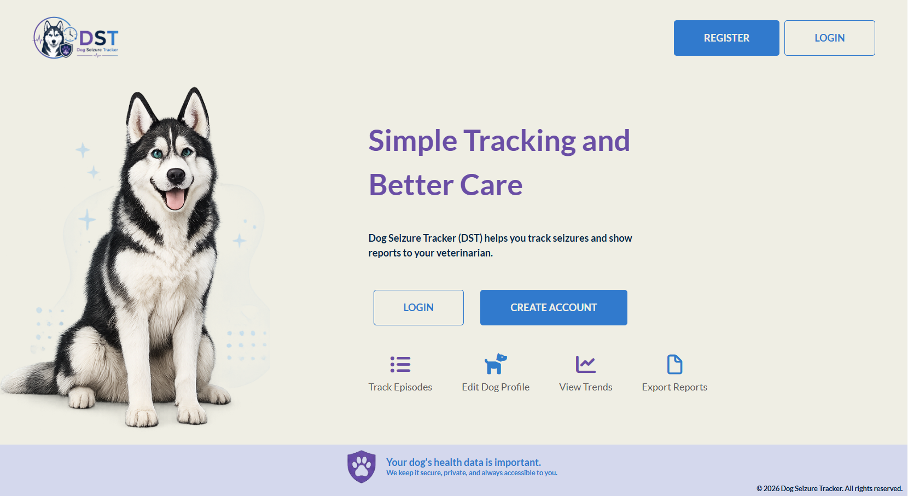

# Project Title: Seizure Tracker Application

Summary: Dog Seizure Tracker is a Java-based application designed to help dog owners monitor and manage their pets' seizure activity. The application provides a centralized platform for recording dog information, and logging seizure events to help owners and veterinarians better understand and manage canine epilepsy and other seizure-related conditions.

### **Key Features**
* User Profile, secure user authentication and login
* Personal account management
* Association of dogs with their owners
* Admin panel for managing user's roles 
* Dog management features
* Seizure log tracking

### **User Profile**
_Users can make an account and edit their information:_

* Username
* Password

* First name
* Last name
* Phone number
* Email address

### **Dog Management**
_Users can register and manage their dogs by recording:_

* Dog name
* Breed
* Gender
* Date of birth
* Food/Diet information

### **Seizure log**
_Users can record seizure events with detailed information:_

* Date of occurrence
* Time of occurrence
* Duration
* Severity level
* Recovery details

### **Roles**

**_Admin can:_**
* change User's role
* delete User's profile

**_User can:_**
* create profile and log in
* edit their information
* delete their profile
* add dog
* edit dog's information
* delete dog
* add seizure log
* edit seizure log
* delete seizure log

### **Technology Stack:**
* Java version: 21
* Spring Boot version: 3.5.14
* Build tool: Maven
* Database: MySQL
* Backend: Spring framework
* Front-End: Spring MVC + Thymeleaf
* Getting Started Prerequisites

_To run this project locally, you will need:
Java Development Kit (JDK) [17+]
Apache Maven [3.8+]
MySQL Server
An IDE (e.g., IntelliJ IDEA, Eclipse)
Installation Clone the Repository: _ git clone https://github.com/Miryana-st/dog-seizure-tracker.git cd dog-seizure-tracker
__

Database Setup: _ spring.datasource.url=jdbc:mysql://localhost:3306/seizure-tracker-application spring.datasource.username=[your_username] spring.datasource.password=[your_password] _

Run the Application: run Application.java as a Java application from your IDE or use the command line: mvn spring-boot:run

Access the Application: Open your web browser and navigate to http://localhost:8080/ (or the port specified in your configuration)_
