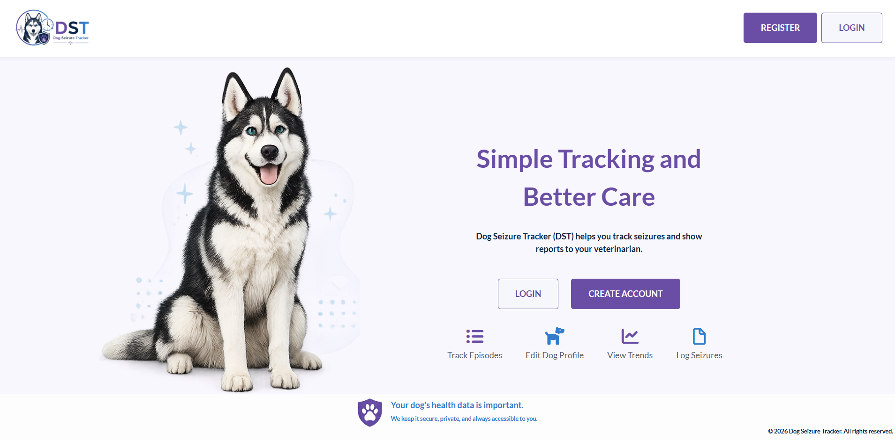

# Dog Seizure Tracker

Dog Seizure Tracker is a Spring Boot web application that helps dog owners track seizure history, manage medications and schedules, and keep structured health records for each dog.



## Project Architecture

This project is built as two independent Spring Boot applications:

1. **Main application** [dog-seizure-tracker](https://github.com/Miryana-st/dog-seizure-tracker)  
   User-facing web app (Spring MVC + Thymeleaf), authentication, dog and seizure management, reporting.
2. **REST microservice** [medication-svc](https://github.com/Miryana-st/medication-svc)  
   Medication and medication schedule management, consumed by the main app via OpenFeign.

Each app runs on its own port and uses its own database.

## Architecture Overview

```text
Browser (Thymeleaf UI)
        |
        v
Main App (dog-seizure-tracker, :8080)
  Controllers -> Services -> JPA Repositories -> MySQL (dog_seizure_tracker_app)
        |
        | OpenFeign
        v
Medication Microservice (medication-svc, :8081)
  REST Controllers -> Services -> JPA Repositories -> MySQL (medication_svc)
```

Main app handles authentication, authorization, dogs, seizures, and reporting.  
Medication data is managed by `medication-svc` and consumed by the main app through REST calls.

## Core Features

### User & Security
- User registration and login
- Profile view and profile editing
- Role-based access with `USER` and `ADMIN`
- Admin user management and role switching

### Dog Management
- Add dog profile
- Edit dog details
- Delete dog profile
- View dogs linked to the logged-in user

### Seizure Tracking
- Add seizure entry
- Edit seizure entry
- Delete seizure entry
- View seizure history by dog
- Monthly seizure summary generation (scheduled)
- Export seizure report to PDF

### Medication Integration (via `medication-svc`)
- Create, update, delete, and view medications for a dog
- Create, update, delete, and view medication schedules
- View due medication schedules

## Technology Stack

- Java 21
- Spring Boot 3.4.0
- Maven
- MySQL
- Spring MVC + Thymeleaf
- Spring Data JPA
- Spring Security
- Spring Cache
- OpenFeign
- Bean Validation

## Integrations

- **Medication microservice:** `https://github.com/Miryana-st/medication-svc`
- **Inter-service communication:** OpenFeign (`http://localhost:8081/api/v1`)
- **PDF generation:** `openhtmltopdf`

## Endpoint Overview (Main Application)

### Auth & Home

| Method | Endpoint | Description |
|---|---|---|
| GET | `/` | Landing page |
| GET | `/register` | Registration form |
| POST | `/register` | Create user account |
| GET | `/login` | Login page |
| GET | `/home` | Authenticated home page |

### Users

| Method | Endpoint | Description |
|---|---|---|
| GET | `/users` | Admin list of users |
| PUT | `/users/{id}/role` | Admin role switch |
| GET | `/users/{id}/details` | User/Admin profile view |
| PUT | `/users/{id}/details` | User/Admin profile update |
| DELETE | `/users/{id}` | User/Admin account delete |

### Dogs

| Method | Endpoint | Description |
|---|---|---|
| GET | `/dogs` | List current user dogs |
| GET | `/dogs/new` | New dog form |
| POST | `/dogs/new` | Create dog |
| GET | `/dogs/{id}/details` | Dog profile view |
| PUT | `/dogs/{id}/details` | Update dog |
| DELETE | `/dogs/{id}` | Delete dog |

### Seizures

| Method | Endpoint | Description |
|---|---|---|
| GET | `/dogs/{dogId}/seizures` | List seizure entries for dog |
| GET | `/dogs/{dogId}/seizures/new` | New seizure form |
| POST | `/dogs/{dogId}/seizures` | Create seizure entry |
| GET | `/dogs/{dogId}/seizures/{seizureId}/details` | Seizure details page |
| PUT | `/dogs/{dogId}/seizures/{seizureId}/seizure-profile` | Update seizure entry |
| DELETE | `/dogs/{dogId}/seizures/{seizureId}` | Delete seizure entry |
| GET | `/dogs/{dogId}/seizures/pdf` | Export seizure report PDF |

### Medication UI (backed by microservice)

| Method | Endpoint | Description |
|---|---|---|
| GET | `/medications` | Medication selection page |
| GET | `/medications/{dogId}` | Dog medication list page |
| GET | `/medications/{dogId}/new` | New medication form |
| POST | `/medications/{dogId}/new` | Create medication (via Feign) |
| GET | `/medications/{dogId}/{medicationId}/details` | Medication details page |
| PUT | `/medications/{dogId}/{medicationId}/details` | Update medication (via Feign) |
| DELETE | `/medications/{dogId}/{medicationId}` | Delete medication (via Feign) |

### Medication Schedule UI (backed by microservice)

| Method | Endpoint | Description |
|---|---|---|
| GET | `/medication-schedule` | Schedule selection page |
| GET | `/medication-schedule/{dogId}` | Dog schedule list + due items |
| GET | `/medication-schedule/{dogId}/new` | New schedule form |
| POST | `/medication-schedule/{dogId}/new` | Create schedule (via Feign) |
| GET | `/medication-schedule/{dogId}/{medicationScheduleId}/details` | Schedule details page |
| PUT | `/medication-schedule/{dogId}/{medicationScheduleId}/details` | Update schedule (via Feign) |
| DELETE | `/medication-schedule/{dogId}/{medicationScheduleId}` | Delete schedule (via Feign) |

## Endpoint Overview (Medication Microservice)

Base URL: `http://localhost:8081/api/v1`

### Medications API

| Method | Endpoint | Description |
|---|---|---|
| GET | `/medications/{dogId}` | Get all medications for a dog |
| POST | `/medications/{dogId}/new` | Create medication |
| GET | `/medications/{dogId}/{medicationId}/details` | Get medication by id |
| PUT | `/medications/{dogId}/{medicationId}/details` | Update medication |
| DELETE | `/medications/{dogId}/{medicationId}` | Delete medication |

### Medication Schedule API

| Method | Endpoint | Description |
|---|---|---|
| GET | `/medication-schedule/{dogId}` | Get all schedules for a dog |
| POST | `/medication-schedule/{dogId}/new` | Create schedule |
| GET | `/medication-schedule/{dogId}/due` | Get due schedules for a dog |
| GET | `/medication-schedule/{dogId}/{medicationScheduleId}/details` | Get schedule by id |
| PUT | `/medication-schedule/{dogId}/{medicationScheduleId}/details` | Update schedule |
| DELETE | `/medication-schedule/{dogId}/{medicationScheduleId}` | Delete schedule |

## Project Structure

```text
dog-seizure-tracker/
  src/main/java/app/
    config/               # Security and global exception handling
    model/                # Entities and DTOs
    repository/           # JPA repositories
    service/              # Business logic and Feign integrations
    web/                  # MVC controllers
    job/                  # Scheduled jobs
  src/main/resources/
    templates/            # Thymeleaf pages
    static/               # CSS and images
    application.properties
  src/test/java/          # Unit, integration, and API tests

medication-svc/
  src/main/java/app/
    config/               # API exception handling
    model/                # Entities and DTOs
    repository/           # JPA repositories
    service/              # Medication business logic
    web/                  # REST controllers
    job/                  # Scheduled checks
    Application.java
  src/main/resources/
    application.properties
  src/test/java/          # Unit, integration, and API tests
```

## Running the Project

### Prerequisites

- JDK 17+
- Maven 3.8+
- MySQL

### Start Main Application

1. Clone repository:
   `git clone https://github.com/Miryana-st/dog-seizure-tracker.git`
2. Configure database in `src/main/resources/application.properties`.
3. Run:
   `mvn spring-boot:run`
4. Open:
   `http://localhost:8080`

### Start Medication Microservice

1. Clone repository:
   `git clone https://github.com/Miryana-st/medication-svc.git`
2. Configure database in `src/main/resources/application.properties`.
3. Run:
   `mvn spring-boot:run`
4. Service base URL:
   `http://localhost:8081/api/v1`
